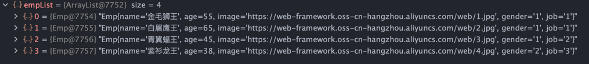
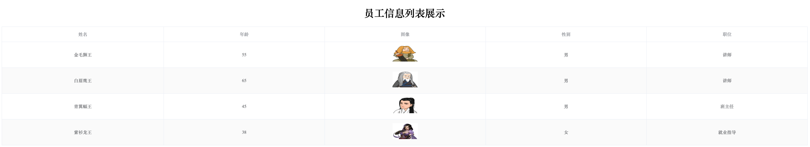

**访问地址**
```
http://localhost:8080/listEmp
```

**再对数据进行处理**
```java
//2. 对数据进行转换处理 - gender, job
empList.forEach(emp -> {
    //处理 gender 1: 男, 2: 女
    String gender = emp.getGender();
    if("1".equals(gender)){
        emp.setGender("男");
    }else if("2".equals(gender)){
        emp.setGender("女");
    }

    //处理job - 1: 讲师, 2: 班主任 , 3: 就业指导
    String job = emp.getJob();
    if("1".equals(job)){
        emp.setJob("讲师");
    }else if("2".equals(job)){
        emp.setJob("班主任");
    }else if("3".equals(job)){
        emp.setJob("就业指导");
    }
});
```
**响应数据**
```java
return Result.success(empList);
```
**得到json**
```json
{
    "code": 1,
    "msg": "success",
    "data": [
        {
            "name": "金毛狮王",
            "age": 55,
            "image": "https://web-framework.oss-cn-hangzhou.aliyuncs.com/web/1.jpg",
            "gender": "男",
            "job": "讲师"
        },
        {
            "name": "白眉鹰王",
            "age": 65,
            "image": "https://web-framework.oss-cn-hangzhou.aliyuncs.com/web/2.jpg",
            "gender": "男",
            "job": "讲师"
        },
        {
            "name": "青翼蝠王",
            "age": 45,
            "image": "https://web-framework.oss-cn-hangzhou.aliyuncs.com/web/3.jpg",
            "gender": "男",
            "job": "班主任"
        },
        {
            "name": "紫衫龙王",
            "age": 38,
            "image": "https://web-framework.oss-cn-hangzhou.aliyuncs.com/web/4.jpg",
            "gender": "女",
            "job": "就业指导"
        }
    ]
}
```
**访问emp文件**
```
http://localhost:8080/emp.html
```
